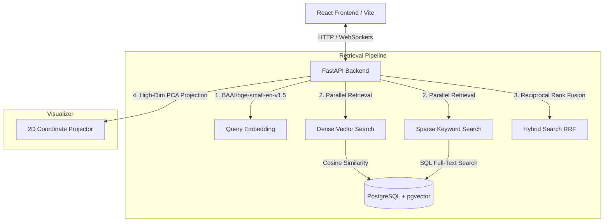

# RAG Retrieval Comparator 🔍⚡

A state-of-the-art interactive benchmarking dashboard and visual comparison tool for **Dense, Sparse, and Hybrid RAG retrieval** strategies. Powered by PostgreSQL (`pgvector`), FastAPI, and React 19.

---

## 🌟 Key Features

- **Side-by-Side Retrieval Comparison**: Search a query and view detailed comparative outputs of **Dense** (vector search), **Sparse** (lexical/BM25-fallback search), and **Hybrid** (Reciprocal Rank Fusion - RRF) retrieval pipelines in real-time.
- **Dynamic 2D Vector Visualizer**: Interactive scatter plot projecting high-dimensional vector embeddings of the query and retrieved document passages using a local **Principal Component Analysis (PCA)** algorithm.
- **Performance Benchmarking Dashboard**: Execute and track standardized MRR (Mean Reciprocal Rank) and Recall@10 benchmarks against the **FiQA standard dataset** collection.
- **HNSW Index Tuning**: Configure and re-compile `pgvector` HNSW indexes (`m` and `ef_construction` parameters) dynamically from the web interface in the background.
- **WebSocket Streaming Console**: Interactive terminal component streaming background task logs (Ingestion pipelines, PCA modeling, evaluation runner metrics) live from the server via WebSockets.

---

## 🏗️ System Architecture



---

## 🛠️ Tech Stack

### Frontend (UI & Visualization)
- **Core**: React 19, TypeScript, Vite
- **Styling**: Tailwind CSS
- **Interactions & Charts**: Framer Motion, Recharts, Lucide React
- **Logging**: Real-time WebSocket console integration

### Backend (Retrieval & ML Operations)
- **Framework**: FastAPI (Asynchronous execution model)
- **Database ORM**: SQLAlchemy (Asyncio asyncpg engine)
- **Embeddings Model**: Local `sentence-transformers` inference using `BAAI/bge-small-en-v1.5` (384-dimension dense vectors)
- **Clustering/Projection**: Scikit-Learn (Incremental PCA)
- **Standard Dataset**: Hugging Face `datasets` (FiQA)

### Database
- **PostgreSQL 16** with the native `pgvector` extension for high-performance HNSW index vector queries.

---

## 📦 Project Structure

```text
├── app/
│   ├── api/             # API stream utility loggers
│   ├── evaluation/      # MRR & Recall benchmark evaluation runners
│   ├── ingestion/       # FiQA collection embedders and dataset ingesters
│   ├── retrieval/       # Dense, Sparse (FTS), and Hybrid RRF pipelines
│   ├── config.py        # Pydantic Settings management
│   ├── db.py            # Async engine and session factory
│   ├── init_db.py       # Extension compiler and database seeders
│   ├── main.py          # FastAPI application server and endpoints
│   └── models.py        # SQLAlchemy schema definitions
├── src/
│   ├── components/      # Reusable visual containers (Terminal, VectorVisualizer, AI Assistant)
│   ├── views/           # Dashboard analytics & Side-by-Side search interfaces
│   ├── utils/           # TypeScript API client & WebSocket log streamers
│   ├── App.tsx          # Router and core dashboard layout
│   └── main.tsx         # React app entrypoint
├── docker-compose.yml   # PostgreSQL + pgvector container definition
├── requirements.txt     # Python dependency collection
└── package.json         # Node.js workspace dependencies
```

---

## 🚀 Installation & Setup

Follow these steps to launch the database, backend services, and frontend website.

### Prerequisites
- **Python 3.10+**
- **Node.js 18+**
- **Docker** and **Docker Compose**

---

### Step 1: Launch the Vector Database
Initialize the PostgreSQL instance with `pgvector` pre-configured in the background:
```bash
docker compose up -d
```
*The database will start on `localhost:5432` with username/password/database set to `rag`/`rag`/`ragdb`.*

---

### Step 2: Launch the FastAPI Backend
1. **Initialize and Activate Virtual Environment:**
   ```bash
   python -m venv venv
   # On Windows:
   venv\Scripts\activate
   # On macOS/Linux:
   source venv/bin/activate
   ```
2. **Install Python Dependencies:**
   ```bash
   pip install -r requirements.txt
   ```
3. **Start the Dev Server:**
   ```bash
   python -m uvicorn app.main:app --port 8000
   ```
   *The server automatically boots, triggers database checks, activates the `vector` extension, compiles schema tables, fits the visualizer PCA coordinates, and hosts the endpoints on `http://localhost:8000`.*

---

### Step 3: Launch the React Frontend
1. **Install Package Dependencies:**
   ```bash
   npm install
   ```
2. **Run Vite Development Server:**
   ```bash
   npm run dev
   ```
   *The website will compile and run on [http://localhost:5173](http://localhost:5173).*

---

## 📊 API & Operations Guide

### Ingestion Flow
To ingest the FiQA corpus and documents collection:
- Navigate to the **Data Ingest** panel inside the UI dashboard.
- Click **Trigger Ingest Pipeline**.
- The server will download the golden dataset in the background, embed the texts using `BAAI/bge-small-en-v1.5`, and populate PostgreSQL.
- Monitor the exact chunking and embedding steps live using the **WebSocket Logs Terminal**.

### Benchmark Runs
- Navigate to the **Evaluator** dashboard.
- Specify a custom label for the evaluation run.
- Click **Launch Benchmark Evaluator**.
- The server will run parallel retrieval strategies on the golden queries collection, calculate Mean Reciprocal Rank (MRR@10) and Recall@10, compile execution metrics, and display comparative charts on completion.
